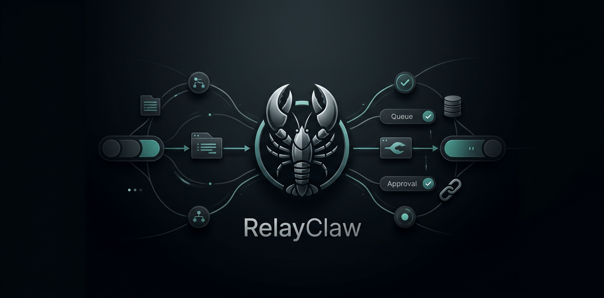

# RelayClaw



**Structured agent handoff and context bridge for OpenClaw crews.**

RelayClaw solves the gap between one agent finishing and another starting. Without it, context is copy-pasted, decisions are lost, costs are invisible, and interrupted sessions disappear into the void. RelayClaw gives every handoff a schema, a queue, an approval gate, and a full audit trail — so your crew operates as a coherent system, not a collection of isolated sessions.

---

## Status

| | |
|---|---|
| **Version** | 1.0.0 |
| **License** | MIT |
| **Repository** | [asimon81/RelayClaw](https://github.com/asimon81/RelayClaw) |
| **Supabase Schema** | v1.0.0 — 8 tables, 5 stored functions |

---

## What is implemented in v1.0.0

Everything below is shipped and working:

- **Heartbeat / Dead-Drop** — Rolling 30s state snapshots per agent session. If a session dies unexpectedly, the dead-drop monitor auto-promotes the last snapshot to an `interrupted` handoff so work is never silently lost.
- **Approval Gate** — Every handoff sits in `pending` until a human approves it (via Telegram or CLI). High-trust agents bypass the gate automatically.
- **FIFO Queue** — Approved handoffs are enqueued per target agent using Postgres-level `FOR UPDATE SKIP LOCKED`. Agents receive work in strict approval order.
- **Context Injection** — Handoff documents are prepended to the target agent's system prompt via the `before_prompt_build` hook at session start.
- **Conflict Resolution** — Three strategies: `merge`, `replace`, or `flag_conflict` (human review). Applied when multiple handoffs target the same agent simultaneously.
- **Schema Versioning** — Handoff document schemas are stored in `schema_registry` with semver versions and migration paths.
- **Cost Ledger** — Every agent session records tokens in/out, USD estimate, and wall-clock time. Per-leg rows roll up to chain aggregates in `handoff_chains`.
- **CLI** — Full `openclaw relay` command suite: list, inspect, approve, reject, inject, complete, queue, heartbeat, cost, schema, chain.
- **Markdown Export** — Each handoff is written to `mdExportDir/<uuid>.md` as a human-readable snapshot.

**Not yet implemented (roadmap):**
- Web-based approval UI (currently Telegram + CLI only)
- RelayClaw skill for natural-language handoff management via chat
- Automated handoff chaining without manual creation
- Per-chain timeout and SLA alerting

---

## Quick Start

**1. Install the plugin**

```bash
openclaw plugin add relayclaw
```

Or from source:

```bash
git clone https://github.com/asimon81/RelayClaw
cd RelayClaw
npm install
openclaw plugin link .
```

**2. Create a Supabase project**

Sign up at [supabase.com](https://supabase.com) or use an existing project.

**3. Run the migration**

Open the Supabase SQL editor (Dashboard → SQL Editor) and run:

```sql
-- File: supabase/migrations/20260328000000_relayclaw_init.sql
-- Copy the full contents of this file into the SQL editor and execute.
```

Or from the CLI:

```bash
npx supabase db push --file supabase/migrations/20260328000000_relayclaw_init.sql
```

The migration creates 8 tables, 5 stored functions, and seeds 12 example agent config rows.

**4. Configure the plugin**

```bash
openclaw config set plugins.entries.relayclaw.config.supabaseUrl https://<your-ref>.supabase.co
openclaw config set plugins.entries.relayclaw.config.supabaseServiceKey <your-service-role-key>
```

> **Security:** Always use the `service_role` key. The plugin bypasses RLS intentionally. Never expose this key in client-side code or public repositories.

**5. Restart OpenClaw**

```bash
systemctl --user restart openclaw
```

You should see `RelayClaw v1.0.0 loaded` in the logs.

---

## Core Concepts

### Handoff Lifecycle

```
pending → approved → queued → injected → completed
                ↓
           interrupted (if session dies before inject)
```

1. **pending** — Created by source agent. Waiting for human approval (unless `autoApproveHighTrust` and trust level is `high`).
2. **approved** — Human or auto-approval granted. Ready to enqueue.
3. **queued** — Enqueued in the target agent's FIFO queue via `enqueue_handoff()`.
4. **injected** — Target agent's session started; `dequeue_handoff()` popped this handoff and injected the context block into the system prompt.
5. **completed** — Target agent called `relay_handoff(action='complete')`. Cost recorded, chain aggregates updated.
6. **interrupted** — Session died before completion. Dead-drop monitor auto-promoted the last heartbeat to a handoff.

### Context Injection Format

When a handoff is injected, the target agent receives a block prepended to its system prompt:

```
=== RELAYCLAW HANDOFF ===
from: <source_agent_id> (<display_name>) | chain: <chain_id> | seq: <sequence>
goal: <goal text>
status: <status_summary>
decisions:
  - <decision>: <rationale>
artifacts:
  - <path> [<type>] <description>
blockers:
  - [<severity>] <description> → <suggested_resolution>
next_steps:
  1. [<priority>] <step>
confidence: <N>%
=== END HANDOFF ===
```

---

## CLI Command Reference

```bash
# Handoff lifecycle
openclaw relay list [--agent <id>] [--status <pending|approved|queued|injected|completed|interrupted>]
openclaw relay inspect <handoff_id>
openclaw relay approve <handoff_id>
openclaw relay reject <handoff_id> [--reason <reason>]
openclaw relay inject <handoff_id>
openclaw relay complete <handoff_id>

# Queue
openclaw relay queue [--agent <id>]
openclaw relay queue flush <agent_id>

# Heartbeat / dead-drop
openclaw relay heartbeat status [--agent <id>]
openclaw relay heartbeat promote <heartbeat_id> [--target <agent_id>]

# Cost
openclaw relay cost [--chain <chain_id>] [--agent <id>]

# Schema
openclaw relay schema list
openclaw relay schema show [<version>]

# Chains
openclaw relay chain list
openclaw relay chain inspect <chain_id>
```

---

## Configuration Reference

All fields go under `plugins.entries.relayclaw.config` in your OpenClaw config.

| Field | Type | Default | Description |
|---|---|---|---|
| `supabaseUrl` | `string` | **required** | Supabase project URL (`https://<ref>.supabase.co`) |
| `supabaseServiceKey` | `string` | **required** | `service_role` key. Never use `anon`. |
| `heartbeatIntervalMs` | `number` | `30000` | Heartbeat snapshot interval in ms. |
| `deadDropThresholdMs` | `number` | `90000` | ms after last heartbeat before dead-drop fires. Recommended: 3x heartbeatIntervalMs. |
| `mdExportDir` | `string` | `~/.openclaw/relayclaw/handoffs/` | Absolute path for `.md` handoff exports. |
| `notifyTarget` | `string` | — | Default Telegram chat ID for approval notifications. |
| `notifyGroupId` | `string` | — | Telegram group ID for topic-routed crew notifications. |
| `autoApproveHighTrust` | `boolean` | `true` | Auto-approve handoffs from agents with `trust_level='high'`. |

### Per-Agent Config (`agent_config` table)

Set per-agent in the `agent_config` table. Changes take effect on the next session — no restart needed.

| Column | Default | Description |
|---|---|---|
| `trust_level` | `'medium'` | `'high'` bypasses approval gate when `autoApproveHighTrust=true`. |
| `default_merge_strategy` | `'flag_conflict'` | `'merge'` · `'replace'` · `'flag_conflict'` when concurrent handoffs arrive. |
| `notify_channel` | `'telegram'` | Notification channel for approval requests. |
| `notify_target` | `null` | Telegram chat ID override for this agent's notifications. |
| `notify_topic_id` | `null` | Telegram `message_thread_id` for group notifications. |
| `max_queue_depth` | `10` | Maximum pending handoffs allowed in this agent's queue. |
| `auto_inject` | `false` | If true, automatically inject the next queued handoff at session start. |
| `heartbeat_interval_s` | `30` | Heartbeat emission frequency in seconds. |
| `heartbeat_dead_threshold_s` | `90` | Seconds of silence before this agent is considered dead. |
| `min_create_interval_s` | `60` | Minimum seconds between handoff creates from this agent. |

---

## End-to-End Example: Geezer → Sabbath

**Setup:** Geezer (research agent, `trust_level='high'`), Sabbath (writing agent, `trust_level='medium'`). `autoApproveHighTrust=true`.

**Geezer finishes research and hands off:**

```
relay_handoff {
  action: "create",
  target_agent_id: "sabbath",
  goal: "Draft the quarterly product update using the attached research brief",
  status_summary: "Research complete. Key findings in artifacts. Three open questions in blockers.",
  decisions: [
    { decision: "Scope limited to Q1 2026", rationale: "Q4 data incomplete" },
    { decision: "Lead with user growth story", rationale: "Most compelling metric per Tony's brief" }
  ],
  artifacts: [
    { path: "~/.openclaw/workspace/research/q1_brief.md", type: "markdown", description: "Full research brief, 4200 words" }
  ],
  blockers: [
    { description: "Q4 churn figure unconfirmed", severity: "low", suggested_resolution: "Omit or use placeholder" }
  ],
  next_steps: [
    { step: "Write 800-word exec summary", priority: "high" },
    { step: "Write full 3000-word body", priority: "high" },
    { step: "Flag gaps back to Geezer", priority: "medium" }
  ],
  confidence: 0.9,
  merge_strategy: "replace"
}
```

**Auto-approval fires.** RelayClaw records `system:auto_trust` in `approval_actions`. Handoff moves to `queued`. Sabbath's queue now has one item.

**Sabbath's next session starts.** The `before_prompt_build` hook fires. `dequeue_handoff('sabbath')` pops Geezer's handoff. The context block is prepended to Sabbath's system prompt:

```
=== RELAYCLAW HANDOFF ===
from: geezer (Geezer) | chain: quarterly-update | seq: 2
goal: Draft the quarterly product update using the attached research brief
status: Research complete. Key findings in artifacts. Three open questions in blockers.
decisions:
  - Scope limited to Q1 2026 (Q4 data incomplete)
  - Lead with user growth story (Most compelling metric per Tony's brief)
artifacts:
  - ~/.openclaw/workspace/research/q1_brief.md [markdown] Full research brief, 4200 words
blockers:
  - [low] Q4 churn figure unconfirmed → Omit or use placeholder
next_steps:
  1. [high] Write 800-word exec summary
  2. [high] Write full 3000-word body
  3. [medium] Flag gaps back to Geezer
confidence: 90%
=== END HANDOFF ===
```

**Sabbath completes.** Calls `relay_handoff(action='complete')`. Cost ledger records Sabbath's session (tokens, USD, wall clock). `update_chain_cost('quarterly-update')` rolls up Geezer + Sabbath costs. Chain total is visible via `openclaw relay cost --chain quarterly-update`.

---

## Architecture

```
  Agent Session (source)
       │
       ├─ heartbeat service ──── rolling 30s snapshots ──────► heartbeats table
       │                              │
       │                         dead-drop monitor
       │                              │ (if session dies)
       │                              ▼
       └─ relay_handoff (create) ──► handoffs table (status: pending)
                                          │
                                    approval gate
                                    (Telegram / CLI)
                                          │ approved
                                          ▼
                                   enqueue_handoff()
                                          │
                                    agent_queues table (FIFO)
                                          │
                                  dequeue_handoff() on inject
                                          │
                                          ▼
                               Target agent session
                               (context injected via before_prompt_build hook)
                                          │
                                    relay_handoff (complete)
                                          │
                                    cost_ledger row
                                    chain aggregates updated
```

**Tables:** `handoff_chains` · `handoffs` · `heartbeats` · `agent_queues` · `approval_actions` · `schema_registry` · `cost_ledger` · `agent_config`

**Stored functions:** `enqueue_handoff` · `dequeue_handoff` · `detect_queue_conflicts` · `promote_heartbeat_to_handoff` · `update_chain_cost`

---

## Security Notes

- The plugin requires the **service_role** key, not the anon key. Row Level Security is intentionally bypassed.
- Never commit `supabaseServiceKey` to version control. Use environment variables or a secrets manager.
- Telegram bot tokens similarly should never be committed.
- Per-agent `notify_target` overrides allow routing notifications to different Telegram chats per agent.

---

## Contributing

See [CONTRIBUTING.md](CONTRIBUTING.md). Migrations require verification output in PR descriptions. Schema document changes require a corresponding `schema_registry` version bump.

---

## License

MIT — see [LICENSE](LICENSE).
